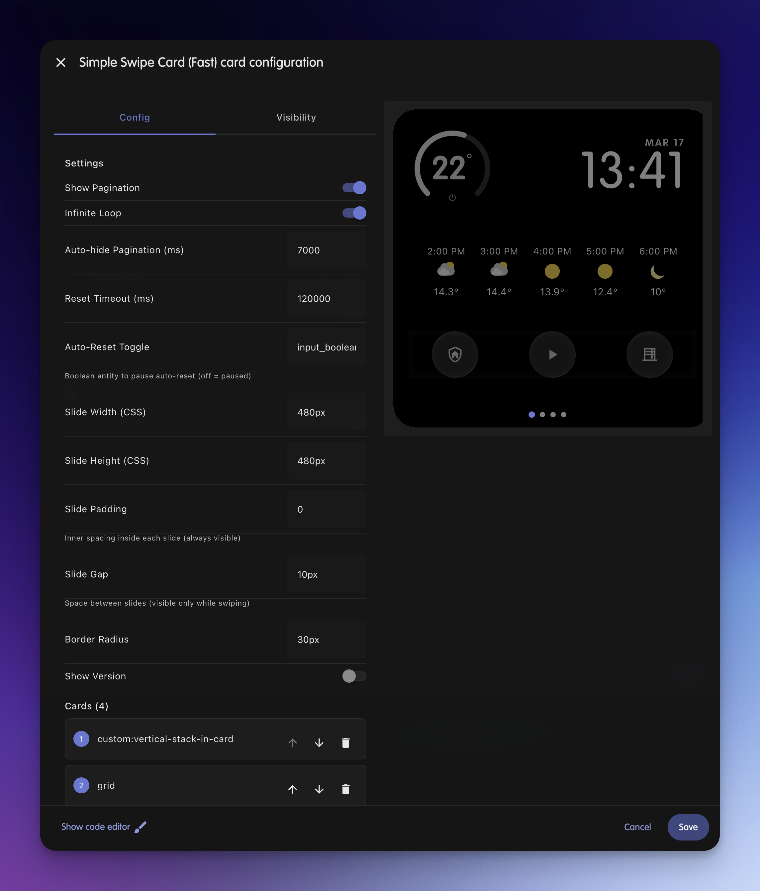

# Swipe Card Lite

A lightweight, performance-optimized swipe carousel card for Home Assistant. Uses native CSS scroll-snap for buttery smooth swiping with optional infinite loop support.


## Features

- Native CSS scroll-snap for smooth, 60fps swiping
- Infinite loop mode for seamless cycling
- Visual editor with full card management
- State entity sync (bidirectional)
- Auto-reset to target card after timeout
- Auto-hide pagination dots
- Customizable slide dimensions, padding, gap, and border radius

## Installation

### HACS (Recommended)

1. Open HACS in Home Assistant
2. Click the three dots menu and select "Custom repositories"
3. Add this repository URL and select "Lovelace" as the category
4. Search for "Swipe Card Lite" and install
5. Restart Home Assistant

### Manual

1. Download `swipe-card-lite.js` from the [latest release](../../releases/latest)
2. Copy to `config/www/swipe-card-lite.js`
3. Add resource in Settings > Dashboards > Resources:
   ```
   /local/swipe-card-lite.js
   ```

## Usage

### Visual Editor

The card includes a full visual editor for easy configuration:



### YAML Configuration

```yaml
type: custom:swipe-card-lite
cards:
  - type: weather-forecast
    entity: weather.home
  - type: entities
    entities:
      - light.living_room
      - light.bedroom
  - type: thermostat
    entity: climate.home
```

## Configuration Options

| Option | Type | Default | Description |
|--------|------|---------|-------------|
| `cards` | array | **required** | Array of card configurations to swipe through |
| `show_pagination` | boolean | `true` | Show pagination dots |
| `start_card` | number | `1` | Initial card to display (1-indexed) |
| `loop_mode` | string | `none` | Loop mode: `none` or `infinite` |
| `state_entity` | string | `null` | Entity to sync position with (e.g., `input_number.xxx`) |
| `auto_hide_pagination` | number | `0` | Auto-hide pagination after ms (0 = disabled) |
| `enable_reset_after` | boolean | `false` | Enable auto-reset to target card |
| `reset_after_timeout` | number | `30000` | Reset timeout in ms |
| `reset_target_card` | number | `1` | Card to reset to (1-indexed) |
| `auto_reset_enabled_entity` | string | `null` | Boolean entity to pause auto-reset |
| `slide_width` | string | `100%` | CSS width of each slide |
| `slide_height` | string | `auto` | CSS height of each slide |
| `slide_padding` | string | `0` | Inner padding of each slide |
| `slide_gap` | string | `0` | Gap between slides |
| `border_radius` | string | `0` | Border radius of slides |
| `show_version` | boolean | `false` | Show version overlay |

## Advanced Examples

### Infinite Loop with Auto-Reset

```yaml
type: custom:swipe-card-lite
loop_mode: infinite
enable_reset_after: true
reset_after_timeout: 60000
reset_target_card: 1
cards:
  - type: markdown
    content: "Card 1"
  - type: markdown
    content: "Card 2"
  - type: markdown
    content: "Card 3"
```

### State Entity Sync

Sync the current card position with an `input_number` helper:

```yaml
type: custom:swipe-card-lite
state_entity: input_number.dashboard_page
cards:
  - type: markdown
    content: "Page 1"
  - type: markdown
    content: "Page 2"
```

Create the helper in Settings > Devices & Services > Helpers:
- Type: Number
- Min: 1
- Max: (number of cards)
- Step: 1

### Peek Next Slide

Show a preview of the next slide:

```yaml
type: custom:swipe-card-lite
slide_width: 90%
slide_gap: 16px
slide_padding: 0 8px
cards:
  - type: markdown
    content: "Card 1"
  - type: markdown
    content: "Card 2"
```

## License

MIT License - see [LICENSE](LICENSE) for details.
